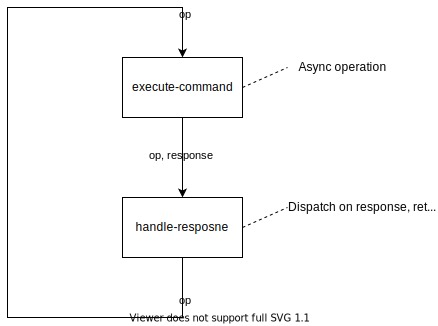

= Walkthrough
:icons: font
:sectanchors: true
:sectlinks: true
:sourcedir: ..
:source-highlighter: coderay
:link-find_job: https://docs.saltstack.com/en/latest/ref/modules/all/salt.modules.saltutil.html#salt.modules.saltutil.find_job[saltutil.find_job]
:link-print_job: https://docs.saltstack.com/en/latest/ref/runners/all/salt.runners.jobs.html#salt.runners.jobs.print_job[jobs.print_job]

clj-salt-api is data oriented Clojure library for interacting with Saltstack through http://docs.saltstack.com/en/latest/ref/netapi/all/salt.netapi.rest_cherrypy.html#module-salt.netapi.rest_cherrypy.app[salt-api]

The aim of this document is to provide motivation, decisions, code samples and caveats behind clj-salt-api. This is my first Clojure project, so I have created this document for me as a developer to understand (and remember) decisions with their benefits and drawbacks, but it can serve as documentation for everyone interested in this library.

== Clojure and Saltstack
https://docs.saltstack.com[Saltstack] is a configuration management and orchestration tool with solid remote execution framework. Salt is written in Python and leverages https://zeromq.org/[ZeroMQ messaging library], which allows users to run tasks simultaneously with satisfying performance.

Saltstack architecture is very flexible, it provides master-client (master-minion), master-less or ssh slaves setup. There are basically three options to interact with Salt master:

* CLI on master node
* Python API on master node
* https://docs.saltstack.com/en/latest/ref/cli/salt-api.html[HTTP API] to run commands remotely - used by clj-salt-api

Saltstack provides plethora of modules running on almost all operating systems.

'''

https://clojure.org/[Clojure] is well known programming language. Although the main reason why I have chosen Clojure is Clojure itself ;), it has several interesting properties that suite this project well.

With Clojure dynamic nature and very good data structures, clj-salt-api supports almost all Salt modules. clj-salt-api sends requests to Salt as data (Clojure maps) and returns data back. This approach is heavily inspired by https://github.com/cognitect-labs/aws-api[aws-api]. It makes API very simple and there are no differences to Saltstack API. Therefore user of clj-salt-api can benefit from https://docs.saltstack.com/en/latest/[Saltstack official documentation] and this library has minimal compatibility issues with different Saltstack versions.

Salstack provides both synchronous and asynchronous API. clj-salt-api aims to support both approaches and Clojure asynchronous/multi-threading solutions can ensure clean design.

== Motivation
There are basically two reasons behind this project:

* There is no client Saltstack client library in Clojure
* Proper handling of salt-api asynchronous workflow requires fair amount of work - clj-salt-api hides this workflow and provides simple API for its users

=== Saltstack asynchronous workflow
Implementation of salt-api asynchronous requests relies on https://docs.saltstack.com/en/master/topics/event/events.html[event system] and https://docs.saltstack.com/en/getstarted/event/index.html[event-driven infrastructure]. Salt's internal components communicate with each other by sending and listening to events. Each command has dedicated job with unique _job-id_. "Job sents" and "job returns" are represented as events on saltstack event-bus.

Salt-api `/events` endpoint exposes Salt event-bus as HTTP stream formatted per the https://html.spec.whatwg.org/multipage/server-sent-events.html[Server Sent Events (SSE) spec]. Each event is formatted as JSON.

Simplified asynchronous request flow (as described https://docs.saltstack.com/en/latest/ref/netapi/all/salt.netapi.rest_cherrypy.html#long-running-http-connections[here]):

. Connect to `/events` endpoint and buffer all events.
. Send HTTP request with async client (https://docs.saltstack.com/en/latest/topics/netapi/index.html#salt.netapi.NetapiClient.local_async[local_async], https://docs.saltstack.com/en/latest/topics/netapi/index.html#salt.netapi.NetapiClient.runner_async[runner_async] or https://docs.saltstack.com/en/latest/topics/netapi/index.html#salt.netapi.NetapiClient.wheel_async[wheel_async]) and receive _job-id_ and target minions (if appropriate) in response. Runner and wheel clients run on master, so there is no reason to parse target minions.
. Filter events buffer for "job return" events with expected _job-id_ and _minion-id_ and deliver response to caller.
. Listen to remaining (expected) "job return" events with expected _job-id_ and deliver minion response to caller.

Things to consider:

 * One or more target minions have not sent "job return" event within specified timeout
 ** Execute {link-find_job} function on timed out minions to check the job result.
 ** If {link-find_job} returns an error, deliver error response for all timed out minions.
 ** If {link-find_job} returns successfully, but response contains minion failures, deliver error response for failed minions and continue processing "job return events" until all expected minions return.
 * `/events` endpoint has been closed during asynchronous request
 ** If it is not possible to reconnect within specified backoff strategy, deliver error and close async request.
 ** If connection to `/events` endpoint has been successfully reopened, fetch "job returns" with {link-print_job} function. Deliver responses for already finished minions and continue processing of "job return events" until all expected minions return.

NOTE: Saltstack does not send https://html.spec.whatwg.org/multipage/server-sent-events.html#event-stream-interpretation[`Last-Event-ID`] header when reconnecting to `/events`, so client has to fetch job results with runner job module.

=== Other features

[cols="1h,2"]
|===

| Authentication
| Saltstack requires user to authenticate. clj-salt-api authenticates user, handles token expiration and automatic re-authentication under the hood.
| Synchronous requests
| Besides support for asynchronous workflow, clj-salt-api also enables synchronous requests
| Tread-safety when executing parallel requests
a| clj-salt-api allows to execute multiple requests (async or sync) in parallel with only one connection to `/events` endpoint. This connection can be set up in two modes:

* Keep HTTP connection opened even there is no asynchronous request running.
* clj-salt-api ensures there is only one connection opened, but it will closed, if it is not needed any more (no async request running) and opened if its needed (not connected and async request started).

| Stream of all events
| clj-salt-api provides an API for listening to all events on Saltstack event-bus.
| Graceful shutdown
| It is common, that Salt commands could take several minutes (e.g. package management commands). So there is need to shutdown client and correctly cancel running requests.
| HTTP support
| clj-salt-api relies on HTTP when communicating with Saltstack. It needs to support various HTTP features (Authentication, Proxy, Custom Headers, ...)
| Retries with backoff policies
| clj-salt-api executes number of remote calls and as we all know network can be unreliable.
|===

== Basic architecture

Simplified sketch of asynchronous flow design:

[.text-center]

. Sse (go block) is started during link:{sourcedir}/src/salt/client.clj[client initialization]. It listens to subscriptions with `subs-chan` and sends sse events or subscription responses to `sse-resp-chan` with attached https://clojuredocs.org/clojure.core.async/mult[mult].
. For each async request clj-salt-api creates a `recv-chan` and starts a new go block which delivers responses to `async-resp-chan`.
. Async request (go block) subscribes to sse events by sending subscription to `subs-chan` with unique `correlation-id`.
. After sse receives subscription with `correlation-id` through `subs-chan`, it copies `sse-resp-chan` (with https://clojuredocs.org/clojure.core.async/tap[tap]) to `recv-chan` and makes sure its connected to `/events` endpoint. The state of `/events` connection depends on keep-alive setting.
. Only after sse is connected to `/events`, it sends the subscription response with corresponding `correlation-id` back to `sse-resp-chan`.
. When async request receives the subscription response, it submits its job (module function call) to saltstack and receives `job-id` and target minions back (if appropriate).
. Async request waits for responses of all target minions, delivers them to `async-resp-chan` as they come and closes the `async-resp-chan`.

NOTE: clj-salt-api implements similar flow for __all events stream__.

=== Error handling

There are basically 3 types of errors:

* minion error
** async request just delivers minion error to caller
* `/events` error
** sse tries to reconnect to `/events` endpoint
** if reconnection is successful,
*** sse sends reconnected message to `sse-resp-chan`
*** all running async requests have to fetch job result with {link-print_job}, because job can be already finished and "job return" event has been missed (saltstack does not support `Last-Event-ID` concept)
*** all running async requests deliver already finished jobs and continue consuming `recv-chans` until all expected minion responses are delivered
** if reconnection is not successful, all running async requests deliver error and close respective `async-resp-chan`s
* minion timed out ("job return" event has not been delivered within specified time)
*** async request executes {link-find_job} to check job status
*** if `saltutil.find_job` fails, async request delivers error and close respective `async-resp-chan`
*** if `saltutil.find_job` succeeds, async request deliver only failed minions and waits for events from remaining with `recv-chan`

=== State handling

clj-salt-api has to manage 2 types of state.

The first one is simple. Its client related information like salt master settings, salt token, `subs-chan` etc. clj-salt-api uses atom (referred as `client-atom` in code) to hold this information.

The second one is trickier. clj-salt-api has a state associated with go blocks (sse, async request, all events stream and sync request). All go blocks implement solution similar to the one mentioned in https://clojuredesign.club/episode/026-one-call-to-rule-them-all/[clojuredesign.club episode 026]. I highly recommend clojuredesign.club podcast and want to thank Chris and Nate for sharing a lot of their knowledge.

Each go block is a loop with state (a map named `op`) and two steps. The state (`op`) consists of current command and various data (correlation-id, list of target minions, minion timeout, number of retries, ...) specific to go block. The steps:

. `execute-command` - call async function (reading/writing to channel) and returns channel message as response
. `handle-response` - pure function that accepts current state (`op`) and command response as parameters and returns new state (`op`). Go block loop stops when there is no new state returned from `handle-response`.

[.text-center]

[[async-code]]
Sample code:
[source,clojure]
----
include::{sourcedir}/src/salt/client/async.clj[lines=253..253;258..272]

include::{sourcedir}/src/salt/client/async.clj[lines=297..297;310..342]
----

NOTE: This solution is just a simplified state machine. I have been thinking in splitting it in multiple http://250bpm.com/blog:69[state machines], but I still find it as a readable code, so I have left it as it is.

=== Caveats
Implementing async flows with core.async has been relatively easy task, nevertheless I have ran into two serious problems I'd like to share. I recommend to set buffers length to 0 for all core.async channels to detect similar problems.

NOTE: It would be very helpful to have an option to monitor channels (e.g. list all core.async channels and their buffer capacity in runtime), but I have not found any.

==== Deadlock n. 1
This type of deadlock is described in https://medium.com/@elizarov/deadlocks-in-non-hierarchical-csp-e5910d137cc[this article] by Roman Elizarov.

The deadlock happens when sse tries to deliver an event with `sse-resp-chan` and async request tries to unsubscribe. Sse is blocked on sending event to `sse-resp-chan` and does not read `subs-chan` and async request is blocked on sending unsubscribe message to `subs-chan` and does not read `recv-chan` (copy of `sse-resp-chan`).

To overcome this problem clj-salt-api uses https://clojuredocs.org/clojure.core.async/alt![alt!] when reading/writing to pair of pub/sub channels.

==== Deadlock n. 2

Deadlock n.2 is not so obvious as n.1 and took me some time to find the root cause. It is better explained through example. For the purpose of example, lets assume user of clj-salt-api library executes async request `pkg.installed`, but sse is reconnected during this request. As described earlier, after sse reconnection async request (`pkg.installed`) has to fetch job status with {link-print_job}. What happens in this scenario?

* We have two running async requests (`pkg.installed` and `job.print_job`) with two different `recv-chans` tapped from `sse-resp-chan` mult.
* `pkg.installed` has created new `async-resp-chan` for `job.print_job` and is parked in take from this chan (it is waiting for response from print_job)
* `job.print_job` has been successfully subscribed to sse and has submitted job to saltstack
* "job sent" event is sent back from saltstack to `/events` endpoint and is delivered from HTTP client to sse go block
* sse puts "job sent" event to `sse-resp-chan`
* event is distributed to all taps in parallel an synchronously, which means it is put to `pkg.installed recv-chan` and `job.print_job recv-chan`
* `job.print_job` takes "job sent" event and continue waiting for "job return" event (park in take from `recv-chan`)
* `pkg.installed` is parked in taking response from `jobs.print_job` and does not take "job sent" event
* sse is deadlock in putting "job sent" event to `sse-resp-chan` mult, because `pkg.installed` has not taken value and its buffer length is 0. clj-salt-api uses non zero length buffer on `recv-chan` in release version, but to detect deadlocks, it uses channels without buffers

==== Setting buffer size

One interesting topic I'd like to mention is how to set correct buffer sizes in core.async channels. General recommendation mentioned in core.async documentation is to set buffer size for slow consumers not to block quick consumers. Let's examine our channels:

[cols="1,2,1"]
|===
| Channel | Data | Buffer size
| `sse-chan`
| consumer (sse go block) could be parked in sending data to async request, which could be parked taking from in find_job or print_job
| buffer needed
| `subs-chan`
| consumer (sse go block) could be parked, but async request has to wait for subscription response, so it could be blocked in putting message to `subs-chan`
| no buffer needed
| `sse-resp-chan`
| mult exists on top of this channel
| no buffer needed
| `recv-chan`
| one consumer (async request) could be parked in taking from find_job or print_job
| buffer needed
| `async-resp-chan`
| consumer is outside of clj-salt-client, so it will be better to pass the channel as a parameter
| not applicable
|===

== Code conventions
I have struggled with code readability at first. All functions looked similar and I had problems to understand function body after some time passed.

To overcome this problem, I have found three helpful conventions:

. <<Destructuring function arguments>>
. <<Small functions>>
. <<Comments>>

Another technique I have found useful <<Passing data down>> (maybe there is a better name in Clojure community, which I am not aware of).

=== Destructuring function arguments
Whenever possible clj-salt-api uses destructuring. This technique helps me to understand the data passed to function, just looking at a function name and parameters.

Example:
[source,clojure]
----
include::{sourcedir}/src/salt/client/sse.clj[lines=96..108]
----

=== Small functions
Clojure is very consistent and concise language. Often a function is one block (threading macro/go-block/if/case...) with several calls of map/filter/assoc/update/.... I understand the pros, but having functions all build up from core libraries, made my code less readable. So every time I have written a function body that I have not understand at the first look, I have tried to extract functions with names easy to read (even if extracted functions are one-liners and used only once).

Example:
[source,clojure]
----

include::{sourcedir}/src/salt/http.clj[lines=114..121;130..147]
----

=== Comments
Third technique that helps with code readability is surprisingly "comments". Yeah I know that "Good code is its own documentation". Maybe this is not that good code ;). Anyway I have found useful:

* Docstrings for public API
** Obvious
* Docstrings for private functions
** explaining reasons, why this function exists - this helps to understand the context
** explaining not obvious implementation (why this function calls sync instead of async interface)
** containing examples of passed parameters - saltstack response can be deep data structure and example of data in documentation helps to understand the body when destructuring is not possible

Example:
[source,clojure]
----
include::{sourcedir}/src/salt/client/async.clj[lines=87..106]
----

=== Passing data down
Well known technique from Clojure world is to pass one data structure to functions down the pipeline and every function pickups up only values it actually needs. It does not have to understand whole data structure.
clj-salt-api uses HTTP to communicate with salt-api and it uses https://github.com/ztellman/aleph[Aleph] library for this purpose. Aleph follows https://github.com/ring-clojure[Ring] spec and clj-salt-api request functions also accepts the same ring request map as a parameter. Passing data down has 2 advantages in this case:

* All HTTP related configuration is supported out-of-box (timeouts, proxy configuration, client certificates). Users can refer to official Aleph documentation.
* All Salstack modules are supported out-of-box. Users can refer to official Salstack documentation and there is no need to map from official Salstack function and clj-salt-api function.

Example:
[source,clojure]
----
include::{sourcedir}/examples/samples.clj[lines=81..92]
----

== Testing

Besides usual unit tests for pure functions (data in/data out), I had to figure out how to test async calls. Separating all async calls to one function and implement almost all code with simple functions (mentioned <<async-code,here>>) let me simplify testing.

It is important to mention that I have not applied TDD practices in clj-salt-api, because I have developed all code with REPL and added tests afterwards. I think the best granularity for testing asynchronous saltstack request is to test the flow. I have created macro `test-flow->` for that purpose (to simplify syntax).

Let's take an example:
[source,clojure,indent=0]
----
include::{sourcedir}/test/src/salt/async_test.clj[lines=204..215]
----

. Setup initial state (`op`)
. Create send response as a response to initial command (async request sent a subscribe message to sse)
. Assert that next command is `:connect` (async request is waiting for connected message from sse)
. Create connected response with correlation-id `:all` as a response to `:connect` command
. Assert that next command is `:request` (submitting job to saltstack)
. Create response with job id `job-1` and expected minions `minion1` and `minion2` as a response to `:request` command
. Assert that next command is `:receive` (async request is waiting for minion responses)
. Create timeout response as a response to `:receive` (minions responses have not been delivered within specified timeout)
. Assert that next command :find-job
. ...

All handler functions could be tested separately, but to create current state (`op`) as a parameter to `handle-response` the tests need to understand internal structure. By testing flow, the test does not need internal representation of state, because the state is created with each test step. It verifies only the sequence of steps.

== Future work
* Support for salt-ssh client
* Support for scripting with babashka. It will be possible to create scripts similar to https://github.com/epiccastle/spire[Spire], but with support for all saltstack modules
* Integration tests with saltstack in docker container
